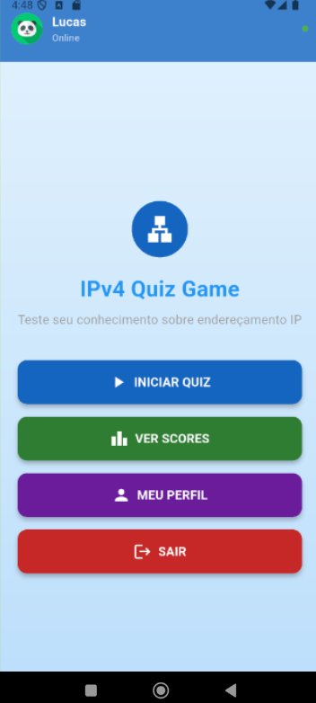
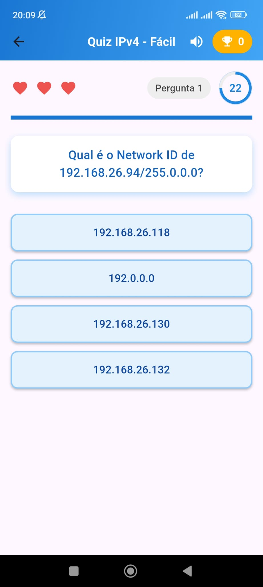

# IPv4 Quiz Game

Um jogo educativo desenvolvido em Flutter para aprender e testar conhecimentos sobre redes IPv4, sub-redes e máscaras de rede através de quizzes interativos e gamificação.

## 📚 Sobre o Projeto

O **IPv4 Quiz Game** é uma aplicação mobile criada com foco no ensino de conceitos fundamentais de redes de computadores. O projeto utiliza elementos de gamificação para tornar o aprendizado mais dinâmico e envolvente, permitindo que os usuários pratiquem conhecimentos sobre:

* Endereçamento IPv4
* Máscaras de rede
* Sub-redes
* Super-redes
* Conceitos básicos de networking

O aplicativo possui diferentes níveis de dificuldade, sistema de ranking e estatísticas de desempenho.

---

## 🎯 Objetivos

* Desenvolver uma aplicação educacional voltada para redes IPv4
* Auxiliar no aprendizado de subnetting e máscaras de rede
* Oferecer um ambiente competitivo com ranking global
* Permitir autenticação de usuários e modo visitante
* Garantir boa experiência em dispositivos móveis

---

## 🚀 Funcionalidades

* ✅ Login e registro de usuários
* ✅ Modo visitante
* ✅ Quizzes com níveis:

  * Fácil
  * Médio
  * Difícil
* ✅ Sistema de vidas
* ✅ Tempo limitado por questão
* ✅ Perfil do usuário
* ✅ Estatísticas e histórico de partidas
* ✅ Ranking global de jogadores

---

## 🛠️ Tecnologias Utilizadas

| Tecnologia     | Descrição                        |
| -------------- | -------------------------------- |
| Flutter 3.13.8 | Framework mobile multiplataforma |
| Dart 3.1       | Linguagem principal              |
| Provider       | Gerenciamento de estado          |
| SQFlite        | Banco de dados SQLite local      |

---

## 📱 Capturas de Tela

<div align="center">

<table>
<tr>
<td align="center">
<br>
<sub>Login</sub>
</td>

<td align="center">
<br>
<sub>Home</sub>
</td>

<td align="center">
<br>
<sub>Profile</sub>
</td>
</tr>
</table>

<br>

<table>
<tr>
<td align="center">
<br>
<sub>Quiz</sub>
</td>

<td width="40"></td>

<td align="center">
<br>
<sub>Ranking</sub>
</td>
</tr>
</table>

</div>

---

## ⚙️ Como Executar o Projeto

### Pré-requisitos

* Flutter SDK instalado
* Dart SDK
* Android Studio ou VS Code
* Emulador Android/iOS ou dispositivo físico

### Clone o repositório

```bash
git clone https://github.com/lucas-morim/ipv4-quiz-game-flutter.git
```

### Acesse a pasta do projeto

```bash
cd ipv4-quiz-game
```

### Instale as dependências

```bash
flutter pub get
```

### Execute o projeto

```bash
flutter run
```

---

## 📖 Estrutura do Projeto

```bash
lib/
├── models/
├── providers/
├── screens/
├── widgets/
├── services/
└── main.dart
```

---

## 🧠 Conceitos Trabalhados

* IPv4 Addressing
* CIDR
* Subnetting
* Network Masks
* Supernetting
* Network Calculations

---

## 📌 Conclusão

O IPv4 Quiz Game demonstrou ser uma ferramenta eficaz para o ensino e revisão de conceitos de redes de computadores, utilizando gamificação para tornar o aprendizado mais acessível e motivador.

Sua estrutura modular permite futuras expansões para outros temas relacionados à área de redes e infraestrutura.

---

## 👨‍💻 Autores

* Lucas Morim
* Rúben Teixeira

ISLA Gaia
